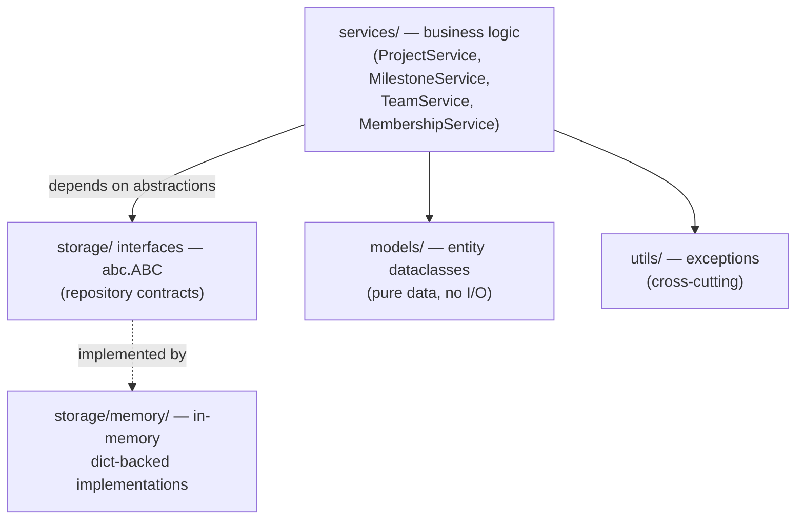
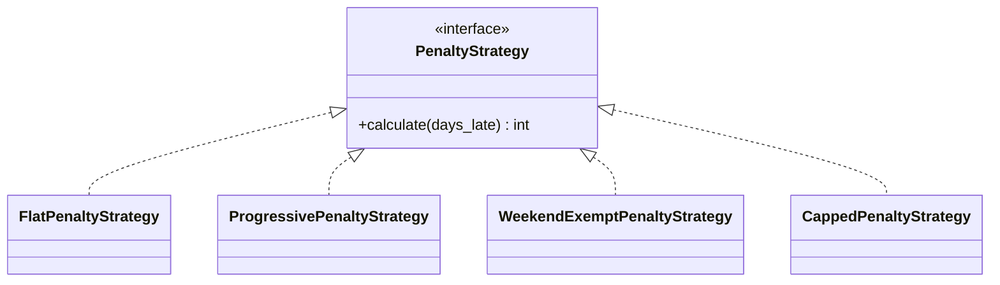

# Student Project Support System

> An in-memory system for managing student projects, teams and deadlines — built to demonstrate clean layered architecture, GoF design patterns, SOLID and a fully automated quality pipeline.

<!-- Badges -->
[](https://github.com/stanko-dev/library-management-system/actions/workflows/ci-pipeline.yml)
[](https://sonarcloud.io/summary/new_code?id=stanko-dev_library-management-system)
[](https://sonarcloud.io/summary/new_code?id=stanko-dev_library-management-system)
[](https://sonarcloud.io/summary/new_code?id=stanko-dev_library-management-system)


---

## Table of Contents

- [Overview](#overview)
- [Key Features](#key-features)
- [Tech Stack](#tech-stack)
- [Architecture](#architecture)
- [Design Patterns](#design-patterns)
- [Business Rules](#business-rules)
- [Project Structure](#project-structure)
- [Getting Started](#getting-started)
- [Testing & Reports](#testing--reports)
- [CI/CD & Quality Gate](#cicd--quality-gate)
- [AI-Driven Setup](#ai-driven-setup)
- [License](#license)

---

## Overview

The system supports the lifecycle of student projects within a course. A **Coordinator** creates projects and assigns teams; **Students** submit milestones before their deadlines. The system automatically calculates late-submission penalties, manages a priority queue for joining full teams, and blocks students who breach discipline thresholds.

All data is kept **in memory** behind repository interfaces — there is no external database or API. This keeps the focus on architecture, testability and clean code.

## Key Features

- Project, team, milestone and submission management.
- Pluggable late-submission penalty algorithms (Strategy pattern).
- Event-driven notifications for deadlines and team availability (Observer pattern).
- Priority queue for joining teams at capacity.
- Automatic student blocking on threshold breaches.
- 541 unit & integration tests, 100% branch coverage.
- Fully automated CI/CD with SonarQube quality gate and downloadable test artifacts.

## Tech Stack

| Area | Technology |
|------|------------|
| Language | Python 3.12 |
| Testing | pytest · pytest-cov · pytest-mock |
| Static analysis | SonarQube Cloud |
| CI/CD | GitHub Actions |
| Containerization | Docker (isolated test runner) |

## Architecture

The codebase is split into four layers. Dependencies flow strictly downward — no layer imports from a layer above it.



**SOLID applied:** each service has a single responsibility; new penalty algorithms and notification handlers are added by implementing an interface (Open/Closed); services depend only on `abc.ABC` abstractions, with concrete repositories injected through the constructor (Dependency Inversion).

Full UML diagrams (Use Case, Domain Model, Class Diagram) live in [`docs/diagrams/`](docs/diagrams) as Mermaid and render directly on GitHub.

## Design Patterns

### Strategy — penalty calculation

A `PenaltyStrategy` interface with interchangeable algorithms. `MilestoneService` receives a strategy via its constructor and calls `calculate()` without knowing which algorithm runs.



### Observer — notifications

A `DeadlineSubject` publishes events; observers such as `StudentNotifier` react when a milestone status changes or a team spot frees up. Services stay decoupled from the notification mechanism.

## Business Rules

- **Progressive penalty:** points grow per overdue day, bounded by a maximum cap.
- **Team join queue:** when a spot frees up, priority goes to the student with the fewest active projects; ties break by request time (FIFO). Requests expire after 7 days.
- **Student blocking:** a student is blocked when unresolved penalty points ≥ 10 **or** missed deadlines ≥ 3. Blocked students cannot join teams.
- **Project status flow:** `DRAFT → ACTIVE → COMPLETED → ARCHIVED` (ARCHIVED is terminal; ACTIVE requires an assigned team).

## Project Structure

```text
library-management-system/
├── src/
│   ├── models/                  # Entity dataclasses — pure data, no I/O
│   │   ├── enums.py             #   status & role enumerations
│   │   ├── student.py           #   Student
│   │   ├── team.py              #   Team
│   │   ├── project.py           #   Project
│   │   ├── milestone.py         #   Milestone (deadline)
│   │   ├── submission.py        #   Submission
│   │   ├── penalty.py           #   Penalty
│   │   └── queue_request.py     #   Team-join request
│   ├── storage/                 # Persistence abstraction (in-memory)
│   │   ├── interfaces.py        #   abstract repository contracts (abc.ABC)
│   │   └── memory/              #   dict-backed implementations
│   ├── services/                # Business logic — dependencies injected
│   │   ├── project_service.py   #   create projects, assign teams, status flow
│   │   ├── milestone_service.py #   submit milestones, apply penalties
│   │   ├── team_service.py      #   priority join-queue, capacity
│   │   ├── membership_service.py#   block / unblock students
│   │   ├── penalty_strategies.py#   Strategy pattern (penalty algorithms)
│   │   └── events.py            #   Observer pattern (notifications)
│   └── utils/
│       └── exceptions.py        #   domain-specific exceptions
├── tests/
│   ├── unit/                    # isolated unit tests (mocks via pytest-mock)
│   └── integration/             # end-to-end scenario tests (real components)
├── docs/
│   ├── requirements.md          # problem statement, actors, use cases
│   └── diagrams/                # UML in Mermaid: use-case, domain, class
├── .claude/
│   └── skills/                  # portable Agent Skills (loaded on demand)
│       ├── architecture/        #   layered-architecture skill (+ reference.md)
│       └── testing/             #   TDD & coverage skill
├── .cursor/
│   └── rules/                   # always-on AI rules (architecture.md, testing.md)
├── .github/
│   └── workflows/
│       └── ci-pipeline.yml      # CI: build → test+coverage → Sonar → artifacts
├── .cursorrules                 # global AI rules (no code without interfaces, TDD)
├── CLAUDE.md                    # Claude Code project context
├── Dockerfile                   # isolated test-run container
├── pyproject.toml               # dependencies + pytest/coverage config
├── sonar-project.properties     # SonarQube Cloud configuration
└── README.md
```

## Getting Started

**Requirements:** Python 3.12+

```bash
# 1. Clone
git clone https://github.com/stanko-dev/library-management-system.git
cd library-management-system

# 2. Create a virtual environment
python3 -m venv .venv
source .venv/bin/activate        # Windows: .venv\Scripts\activate

# 3. Install (with dev dependencies)
pip install -e ".[dev]"
```

## Testing & Reports

```bash
# Run all tests
pytest -v

# Run with branch coverage and a missing-lines report
pytest --cov=src --cov-branch --cov-report=term-missing

# Generate the HTML coverage report
pytest --cov=src --cov-report=html
# then open htmlcov/index.html in a browser
```

The suite generates three report types:

- `coverage.xml` — coverage data for SonarQube.
- `junit.xml` — test results for SonarQube.
- `htmlcov/` — human-readable coverage (see which lines are covered).

Run the suite in an isolated container:

```bash
docker build -t sps-tests . && docker run --rm sps-tests
```

## CI/CD & Quality Gate

Every push and pull request triggers [`ci-pipeline.yml`](.github/workflows/ci-pipeline.yml), which:

1. Checks out the code and sets up Python 3.12.
2. Installs dependencies and builds (compiles) the sources.
3. Runs the test suite and generates coverage reports.
4. Uploads `coverage.xml`, `junit.xml` and `htmlcov/` as the downloadable **`test-reports`** artifact.
5. Sends results to SonarQube Cloud for the Quality Gate.

The `main` branch is protected: changes must go through a pull request, and a PR cannot be merged while the pipeline is red or the Quality Gate fails.

| Metric | Result |
|--------|--------|
| Quality Gate | Passed |
| Coverage | 100% |
| Tests | 541 |
| Bugs / Vulnerabilities | 0 / 0 |
| Maintainability | A |

## AI-Driven Setup

The repository is adapted for autonomous AI agents:

- **Rules** (always-on, local): `.cursorrules` and `.cursor/rules/` hold project conventions — no code without interfaces, TDD, no external DB/API.
- **Skills** (on-demand, portable): `.claude/skills/` contains self-contained Agent Skills (`architecture`, `testing`) that load only when a task matches their description and travel with the repo, so any developer who clones it gets them automatically.
- `CLAUDE.md` provides the always-loaded project context for Claude Code.

## License

This project is licensed under the MIT License — see [`LICENSE`](LICENSE) for details.
