# Class Diagram

Full structural view: models, repository interfaces, in-memory implementations,
business services, and the Strategy and Observer design-pattern hierarchies.

```mermaid
classDiagram
    direction TB

    %% ══════════════════════════════════════════════════════════════════
    %% LAYER 1 — MODELS (pure data, no I/O)
    %% ══════════════════════════════════════════════════════════════════

    class Book {
        +id : str
        +title : str
        +author : str
        +isbn : str
        +total_copies : int
        +available_copies : int
        +status : BookStatus
    }

    class Reader {
        +id : str
        +name : str
        +membership : MembershipType
        +is_blocked : bool
        +active_loans : int
        +overdue_count : int
    }

    class Loan {
        +id : str
        +book_id : str
        +reader_id : str
        +issued_at : datetime
        +due_date : datetime
        +returned_at : datetime | None
        +is_active() bool
        +is_overdue(as_of : datetime) bool
    }

    class Reservation {
        +id : str
        +book_id : str
        +reader_id : str
        +created_at : datetime
        +expires_at : datetime
        +status : ReservationStatus
    }

    class Fine {
        +id : str
        +reader_id : str
        +loan_id : str
        +amount : Decimal
        +is_paid : bool
    }

    class BookAvailableEvent {
        +book_id : str
    }

    class Notification {
        +reader_id : str
        +book_id : str
    }

    %% ══════════════════════════════════════════════════════════════════
    %% LAYER 2 — STORAGE: repository interfaces (ABCs)
    %% ══════════════════════════════════════════════════════════════════

    class BookRepository {
        <<abstract>>
        +add(book : Book) None
        +get_by_id(id : str) Book | None
        +get_by_isbn(isbn : str) Book | None
        +list_all() list[Book]
        +update(book : Book) None
        +delete(id : str) None
        +find_by_title(title : str) list[Book]
        +find_by_author(author : str) list[Book]
        +find_available() list[Book]
    }

    class ReaderRepository {
        <<abstract>>
        +add(reader : Reader) None
        +get_by_id(id : str) Reader | None
        +list_all() list[Reader]
        +update(reader : Reader) None
        +delete(id : str) None
        +find_by_name(name : str) list[Reader]
        +find_active() list[Reader]
        +find_blocked() list[Reader]
    }

    class LoanRepository {
        <<abstract>>
        +add(loan : Loan) None
        +get_by_id(id : str) Loan | None
        +list_all() list[Loan]
        +update(loan : Loan) None
        +delete(id : str) None
        +find_by_reader(reader_id : str) list[Loan]
        +find_by_book(book_id : str) list[Loan]
        +find_active() list[Loan]
        +find_active_by_reader(reader_id : str) list[Loan]
        +find_overdue(as_of : datetime) list[Loan]
    }

    class ReservationRepository {
        <<abstract>>
        +add(res : Reservation) None
        +get_by_id(id : str) Reservation | None
        +list_all() list[Reservation]
        +update(res : Reservation) None
        +delete(id : str) None
        +find_by_reader(reader_id : str) list[Reservation]
        +find_by_book(book_id : str) list[Reservation]
        +find_active() list[Reservation]
        +find_active_by_book(book_id : str) list[Reservation]
    }

    class FineRepository {
        <<abstract>>
        +add(fine : Fine) None
        +get_by_id(id : str) Fine | None
        +list_all() list[Fine]
        +update(fine : Fine) None
        +delete(id : str) None
        +find_by_reader(reader_id : str) list[Fine]
        +find_by_loan(loan_id : str) list[Fine]
        +find_unpaid() list[Fine]
        +find_unpaid_by_reader(reader_id : str) list[Fine]
        +total_unpaid_by_reader(reader_id : str) Decimal
    }

    %% ── In-memory implementations ────────────────────────────────────

    class InMemoryBookRepository {
        -_store : dict
    }
    class InMemoryReaderRepository {
        -_store : dict
    }
    class InMemoryLoanRepository {
        -_store : dict
    }
    class InMemoryReservationRepository {
        -_store : dict
    }
    class InMemoryFineRepository {
        -_store : dict
    }

    BookRepository        <|.. InMemoryBookRepository
    ReaderRepository      <|.. InMemoryReaderRepository
    LoanRepository        <|.. InMemoryLoanRepository
    ReservationRepository <|.. InMemoryReservationRepository
    FineRepository        <|.. InMemoryFineRepository

    %% ══════════════════════════════════════════════════════════════════
    %% LAYER 3 — STRATEGY PATTERN (fine calculation)
    %% ══════════════════════════════════════════════════════════════════

    class FineStrategy {
        <<abstract>>
        +calculate(due_date : date, return_date : date) Decimal
    }

    class FlatFineStrategy {
        -_daily_rate : Decimal
        +calculate(due_date : date, return_date : date) Decimal
    }

    class ProgressiveFineStrategy {
        -_base_rate : Decimal
        -_increment : Decimal
        -_cap : Decimal
        +calculate(due_date : date, return_date : date) Decimal
    }

    class WeekendExemptStrategy {
        -_daily_rate : Decimal
        +calculate(due_date : date, return_date : date) Decimal
    }

    class CappedFineStrategy {
        -_inner : FineStrategy
        -_cap : Decimal
        +calculate(due_date : date, return_date : date) Decimal
    }

    class FineStrategyFactory {
        +flat(daily_rate : Decimal) FlatFineStrategy$
        +progressive(base_rate, increment, cap) ProgressiveFineStrategy$
        +weekend_exempt(daily_rate : Decimal) WeekendExemptStrategy$
        +capped(inner, cap : Decimal) CappedFineStrategy$
        +from_name(name : str) FineStrategy$
    }

    FineStrategy <|.. FlatFineStrategy
    FineStrategy <|.. ProgressiveFineStrategy
    FineStrategy <|.. WeekendExemptStrategy
    FineStrategy <|.. CappedFineStrategy
    CappedFineStrategy o-- FineStrategy : wraps (Decorator)
    FineStrategyFactory ..> FineStrategy : creates

    %% ══════════════════════════════════════════════════════════════════
    %% LAYER 4 — OBSERVER PATTERN (book availability notifications)
    %% ══════════════════════════════════════════════════════════════════

    class BookAvailabilityObserver {
        <<abstract>>
        +on_book_available(event : BookAvailableEvent) None
    }

    class BookAvailabilitySubject {
        <<abstract>>
        +subscribe(obs : BookAvailabilityObserver) None
        +unsubscribe(obs : BookAvailabilityObserver) None
        +notify(event : BookAvailableEvent) None
    }

    class EventBus {
        -_observers : list[BookAvailabilityObserver]
        +subscribe(obs : BookAvailabilityObserver) None
        +unsubscribe(obs : BookAvailabilityObserver) None
        +notify(event : BookAvailableEvent) None
    }

    class ReaderNotifier {
        -_reservation_repo : ReservationRepository
        -_reader_repo : ReaderRepository
        -_notifications : list[Notification]
        +on_book_available(event : BookAvailableEvent) None
        +get_notifications() list[Notification]
        +get_notifications_for_reader(reader_id) list[Notification]
    }

    BookAvailabilitySubject  <|.. EventBus
    BookAvailabilityObserver <|.. ReaderNotifier
    EventBus                 o--  BookAvailabilityObserver : manages
    ReaderNotifier           ..>  ReservationRepository    : queries
    ReaderNotifier           ..>  ReaderRepository         : queries membership
    ReaderNotifier           -->  Notification             : creates

    %% ══════════════════════════════════════════════════════════════════
    %% LAYER 5 — SERVICES (business logic, all deps injected)
    %% ══════════════════════════════════════════════════════════════════

    class LoanService {
        +issue_book(reader_id, book_id, loan_days) Loan
    }

    class ReturnService {
        +return_book(loan_id : str) Fine | None
    }

    class ReservationService {
        +reserve(reader_id, book_id) Reservation
        +cancel(reservation_id) None
        +expire_old(as_of) list[Reservation]
        +get_next_in_queue(book_id) Reservation | None
    }

    class MembershipService {
        +evaluate(reader_id) bool
        +block(reader_id) None
        +unblock(reader_id) None
    }

    %% ── Service → Repository dependencies ───────────────────────────
    LoanService ..> LoanRepository
    LoanService ..> BookRepository
    LoanService ..> ReaderRepository

    ReturnService ..> LoanRepository
    ReturnService ..> BookRepository
    ReturnService ..> ReaderRepository
    ReturnService ..> FineRepository
    ReturnService ..> FineStrategy
    ReturnService ..> BookAvailabilitySubject

    ReservationService ..> ReservationRepository
    ReservationService ..> BookRepository
    ReservationService ..> ReaderRepository

    MembershipService ..> ReaderRepository
    MembershipService ..> FineRepository
```

## Layer Summary

| Layer | Key Classes | Pattern |
|---|---|---|
| **Models** | `Book`, `Reader`, `Loan`, `Reservation`, `Fine` | Plain dataclasses; validation in `__post_init__` |
| **Storage interfaces** | `BookRepository` … `FineRepository` | `abc.ABC` — Dependency Inversion Principle |
| **Storage implementations** | `InMemory*Repository` | Concrete implementations backed by `dict` |
| **Fine calculation** | `FineStrategy` → 4 concrete strategies | **GoF Strategy** — swap policy without changing services |
| **Availability notification** | `BookAvailabilitySubject / Observer` → `EventBus / ReaderNotifier` | **GoF Observer** — `ReturnService` publishes; `ReaderNotifier` reacts |
| **Services** | `LoanService`, `ReturnService`, `ReservationService`, `MembershipService` | All dependencies injected via constructor (DI); depend only on ABCs |

## Design Principles Applied

- **S**ingle Responsibility — each service owns one domain workflow.
- **O**pen/Closed — add a new fine policy by implementing `FineStrategy`; no service code changes.
- **L**iskov Substitution — every `InMemory*Repository` is substitutable for its ABC.
- **I**nterface Segregation — five focused repository interfaces instead of one bloated one.
- **D**ependency Inversion — services receive `BookRepository` (ABC), never `InMemoryBookRepository`.
