# Class Diagram

Full structural view: models, repository interfaces, in-memory implementations,
business services, and the Strategy and Observer design-pattern hierarchies.

```mermaid
classDiagram
    direction TB

    %% ══════════════════════════════════════════════════════════════════
    %% LAYER 1 — MODELS (pure data, no I/O)
    %% ══════════════════════════════════════════════════════════════════

    class Student {
        +id : str
        +name : str
        +role : StudentRole
        +is_blocked : bool
        +active_projects_count : int
        +missed_deadlines_count : int
    }

    class Team {
        +id : str
        +name : str
        +capacity : int
        +member_ids : list
        +is_full() bool
        +available_spots() int
    }

    class Project {
        +id : str
        +title : str
        +description : str
        +status : ProjectStatus
        +team_id : str
        +created_at : datetime
    }

    class Milestone {
        +id : str
        +project_id : str
        +title : str
        +due_date : datetime
        +status : MilestoneStatus
        +submitted_at : datetime
    }

    class Submission {
        +id : str
        +milestone_id : str
        +team_id : str
        +submitted_at : datetime
    }

    class Penalty {
        +id : str
        +student_id : str
        +milestone_id : str
        +points : int
        +is_resolved : bool
    }

    class QueueRequest {
        +id : str
        +student_id : str
        +team_id : str
        +created_at : datetime
        +expires_at : datetime
        +status : QueueRequestStatus
    }

    class MilestoneStatusChangedEvent {
        +milestone_id : str
        +new_status : MilestoneStatus
    }

    class TeamSpotAvailableEvent {
        +team_id : str
    }

    class Notification {
        +student_id : str
        +milestone_id : str
        +team_id : str
    }

    %% ══════════════════════════════════════════════════════════════════
    %% LAYER 2 — STORAGE: repository interfaces (ABCs)
    %% ══════════════════════════════════════════════════════════════════

    class StudentRepository {
        <<abstract>>
        +add(student : Student) None
        +get_by_id(id : str) Student
        +list_all() list
        +update(student : Student) None
        +delete(id : str) None
        +find_by_name(name : str) list
        +find_active() list
        +find_blocked() list
    }

    class TeamRepository {
        <<abstract>>
        +add(team : Team) None
        +get_by_id(id : str) Team
        +list_all() list
        +update(team : Team) None
        +delete(id : str) None
        +find_by_name(name : str) list
    }

    class ProjectRepository {
        <<abstract>>
        +add(project : Project) None
        +get_by_id(id : str) Project
        +list_all() list
        +update(project : Project) None
        +delete(id : str) None
        +find_by_team(team_id : str) list
        +find_by_status(status : ProjectStatus) list
    }

    class MilestoneRepository {
        <<abstract>>
        +add(milestone : Milestone) None
        +get_by_id(id : str) Milestone
        +list_all() list
        +update(milestone : Milestone) None
        +delete(id : str) None
        +find_by_project(project_id : str) list
        +find_pending() list
        +find_overdue(as_of : datetime) list
    }

    class SubmissionRepository {
        <<abstract>>
        +add(submission : Submission) None
        +get_by_id(id : str) Submission
        +list_all() list
        +update(submission : Submission) None
        +delete(id : str) None
        +find_by_milestone(milestone_id : str) list
        +find_by_team(team_id : str) list
    }

    class PenaltyRepository {
        <<abstract>>
        +add(penalty : Penalty) None
        +get_by_id(id : str) Penalty
        +list_all() list
        +update(penalty : Penalty) None
        +delete(id : str) None
        +find_by_student(student_id : str) list
        +find_by_milestone(milestone_id : str) list
        +find_unresolved() list
        +find_unresolved_by_student(student_id : str) list
        +total_unresolved_by_student(student_id : str) int
    }

    class QueueRequestRepository {
        <<abstract>>
        +add(request : QueueRequest) None
        +get_by_id(id : str) QueueRequest
        +list_all() list
        +update(request : QueueRequest) None
        +delete(id : str) None
        +find_by_student(student_id : str) list
        +find_by_team(team_id : str) list
        +find_pending() list
        +find_pending_by_team(team_id : str) list
    }

    %% ── In-memory implementations ────────────────────────────────────

    class InMemoryStudentRepository { -_store : dict }
    class InMemoryTeamRepository { -_store : dict }
    class InMemoryProjectRepository { -_store : dict }
    class InMemoryMilestoneRepository { -_store : dict }
    class InMemorySubmissionRepository { -_store : dict }
    class InMemoryPenaltyRepository { -_store : dict }
    class InMemoryQueueRequestRepository { -_store : dict }

    StudentRepository        <|.. InMemoryStudentRepository
    TeamRepository           <|.. InMemoryTeamRepository
    ProjectRepository        <|.. InMemoryProjectRepository
    MilestoneRepository      <|.. InMemoryMilestoneRepository
    SubmissionRepository     <|.. InMemorySubmissionRepository
    PenaltyRepository        <|.. InMemoryPenaltyRepository
    QueueRequestRepository   <|.. InMemoryQueueRequestRepository

    %% ══════════════════════════════════════════════════════════════════
    %% LAYER 3 — STRATEGY PATTERN (penalty calculation)
    %% ══════════════════════════════════════════════════════════════════

    class PenaltyStrategy {
        <<abstract>>
        +calculate(due_date : date, submitted_date : date) int
    }

    class FlatPenaltyStrategy {
        -_points_per_day : int
        +calculate(due_date : date, submitted_date : date) int
    }

    class ProgressivePenaltyStrategy {
        -_base_points : int
        -_increment : int
        -_cap : int
        +calculate(due_date : date, submitted_date : date) int
    }

    class WeekendExemptPenaltyStrategy {
        -_points_per_day : int
        +calculate(due_date : date, submitted_date : date) int
    }

    class CappedPenaltyStrategy {
        -_inner : PenaltyStrategy
        -_cap : int
        +calculate(due_date : date, submitted_date : date) int
    }

    class PenaltyStrategyFactory {
        +flat(points_per_day : int) FlatPenaltyStrategy$
        +progressive(base, increment, cap) ProgressivePenaltyStrategy$
        +weekend_exempt(points_per_day : int) WeekendExemptPenaltyStrategy$
        +capped(inner, cap : int) CappedPenaltyStrategy$
        +from_name(name : str) PenaltyStrategy$
    }

    PenaltyStrategy <|.. FlatPenaltyStrategy
    PenaltyStrategy <|.. ProgressivePenaltyStrategy
    PenaltyStrategy <|.. WeekendExemptPenaltyStrategy
    PenaltyStrategy <|.. CappedPenaltyStrategy
    CappedPenaltyStrategy o-- PenaltyStrategy : wraps (Decorator)
    PenaltyStrategyFactory ..> PenaltyStrategy : creates

    %% ══════════════════════════════════════════════════════════════════
    %% LAYER 4 — OBSERVER PATTERN (milestone status + team-spot events)
    %% ══════════════════════════════════════════════════════════════════

    class DeadlineObserver {
        <<abstract>>
        +on_milestone_status_changed(event : MilestoneStatusChangedEvent) None
        +on_team_spot_available(event : TeamSpotAvailableEvent) None
    }

    class DeadlineSubject {
        <<abstract>>
        +subscribe(obs : DeadlineObserver) None
        +unsubscribe(obs : DeadlineObserver) None
        +notify_milestone_status(event : MilestoneStatusChangedEvent) None
        +notify_team_spot(event : TeamSpotAvailableEvent) None
    }

    class EventBus {
        -_observers : list
        +subscribe(obs : DeadlineObserver) None
        +unsubscribe(obs : DeadlineObserver) None
        +notify_milestone_status(event : MilestoneStatusChangedEvent) None
        +notify_team_spot(event : TeamSpotAvailableEvent) None
    }

    class StudentNotifier {
        -_milestone_repo : MilestoneRepository
        -_project_repo : ProjectRepository
        -_team_repo : TeamRepository
        -_queue_request_repo : QueueRequestRepository
        -_student_repo : StudentRepository
        -_notifications : list
        +on_milestone_status_changed(event) None
        +on_team_spot_available(event) None
        +get_notifications() list
        +get_notifications_for_student(student_id) list
    }

    DeadlineSubject  <|.. EventBus
    DeadlineObserver <|.. StudentNotifier
    EventBus         o--  DeadlineObserver        : manages
    StudentNotifier  ..>  MilestoneRepository     : queries
    StudentNotifier  ..>  ProjectRepository       : queries
    StudentNotifier  ..>  TeamRepository          : queries
    StudentNotifier  ..>  QueueRequestRepository  : queries priority queue
    StudentNotifier  ..>  StudentRepository       : queries active count
    StudentNotifier  -->  Notification            : creates

    %% ══════════════════════════════════════════════════════════════════
    %% LAYER 5 — SERVICES (business logic, all deps injected)
    %% ══════════════════════════════════════════════════════════════════

    class ProjectService {
        +create_project(title, description, team_id) Project
        +assign_team(project_id, team_id) Project
        +change_status(project_id, new_status) Project
    }

    class MilestoneService {
        +add_milestone(project_id, title, due_date) Milestone
        +submit(milestone_id) tuple
        +mark_missed(milestone_id) list
    }

    class TeamService {
        +create_team(team_id, name, capacity) Team
        +join_or_queue(student_id, team_id) Team
        +leave_team(student_id, team_id) None
        +expire_old(as_of) list
        +get_next_in_queue(team_id) QueueRequest
    }

    class MembershipService {
        +evaluate(student_id) bool
        +block(student_id) None
        +unblock(student_id) None
    }

    %% ── Service → Repository dependencies ───────────────────────────
    ProjectService    ..> ProjectRepository
    ProjectService    ..> TeamRepository

    MilestoneService  ..> MilestoneRepository
    MilestoneService  ..> SubmissionRepository
    MilestoneService  ..> PenaltyRepository
    MilestoneService  ..> ProjectRepository
    MilestoneService  ..> TeamRepository
    MilestoneService  ..> StudentRepository
    MilestoneService  ..> PenaltyStrategy
    MilestoneService  ..> DeadlineSubject

    TeamService       ..> TeamRepository
    TeamService       ..> StudentRepository
    TeamService       ..> QueueRequestRepository
    TeamService       ..> DeadlineSubject

    MembershipService ..> StudentRepository
    MembershipService ..> PenaltyRepository
```

## Layer Summary

| Layer | Key Classes | Pattern |
|---|---|---|
| **Models** | `Student`, `Team`, `Project`, `Milestone`, `Submission`, `Penalty`, `QueueRequest` | Plain dataclasses; validation in `__post_init__` |
| **Storage interfaces** | `StudentRepository` … `QueueRequestRepository` | `abc.ABC` — Dependency Inversion Principle |
| **Storage implementations** | `InMemory*Repository` | Concrete implementations backed by `dict` |
| **Penalty calculation** | `PenaltyStrategy` → 4 concrete strategies | **GoF Strategy** — swap penalty policy without changing services |
| **Event notifications** | `DeadlineSubject / Observer` → `EventBus / StudentNotifier` | **GoF Observer** — `MilestoneService` and `TeamService` publish; `StudentNotifier` reacts |
| **Services** | `ProjectService`, `MilestoneService`, `TeamService`, `MembershipService` | All dependencies injected via constructor; depend only on ABCs |

## Design Principles Applied

- **S**ingle Responsibility — each service owns one domain workflow.
- **O**pen/Closed — add a new penalty policy by implementing `PenaltyStrategy`; no service code changes.
- **L**iskov Substitution — every `InMemory*Repository` is substitutable for its ABC.
- **I**nterface Segregation — seven focused repository interfaces instead of one bloated one.
- **D**ependency Inversion — services receive `StudentRepository` (ABC), never `InMemoryStudentRepository`.
