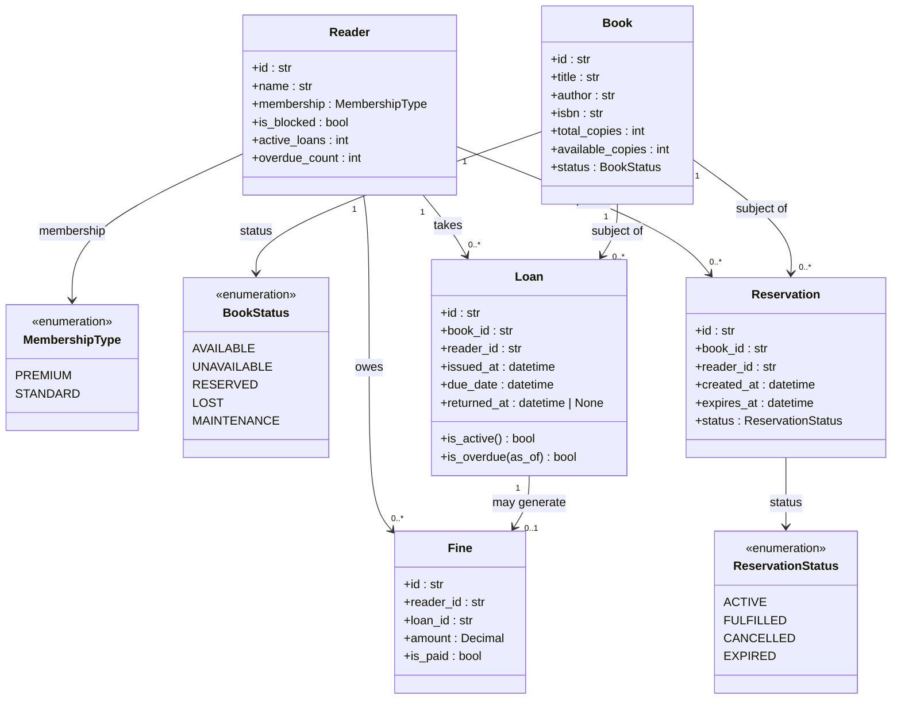

# Domain Model

Core entities, value objects, and their relationships in the Library Management System.

## Relationship Notes

| Relationship | Multiplicity | Description |
|---|---|---|
| Reader → Loan | 1 to 0..* | A reader may have multiple active or historical loans; limited by membership tier (STANDARD ≤ 3, PREMIUM ≤ 5 active at once). |
| Reader → Reservation | 1 to 0..* | A reader may hold at most one active reservation per title at a time. |
| Reader → Fine | 1 to 0..* | Fines accumulate across all overdue loans; total unpaid ≥ $10 triggers a block. |
| Book → Loan | 1 to 0..* | Multiple copies may be on loan simultaneously (`available_copies` tracks what remains). |
| Book → Reservation | 1 to 0..* | Multiple readers may queue for the same book; served in PREMIUM-first, oldest-first order. |
| Loan → Fine | 1 to 0..1 | A fine is created only when `return_date > due_date`; on-time returns generate no fine. |
