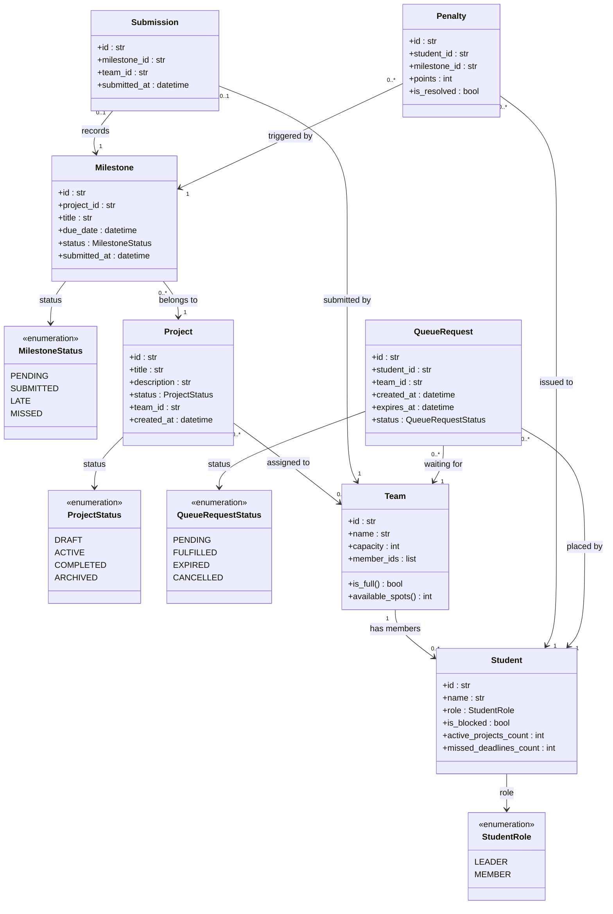

# Domain Model

Core entities, value objects, and their relationships in the Student Project Support System.

## Relationship Notes

| Relationship | Multiplicity | Description |
|---|---|---|
| Team → Student | 1 to 0..* | A team holds a list of member IDs; membership is capped at the team's `capacity`. |
| Project → Team | 0..* to 0..1 | A project may have no team (DRAFT) or exactly one team once assigned. |
| Milestone → Project | 0..* to 1 | Each milestone belongs to exactly one project; a project may have many milestones. |
| Submission → Milestone | 0..1 to 1 | At most one submission per milestone; a second submit attempt raises `AlreadySubmittedError`. |
| Penalty → Student | 0..* to 1 | Multiple penalties may accumulate on one student across different milestones. |
| Penalty → Milestone | 0..* to 1 | Each late or missed milestone generates one penalty per team member. |
| QueueRequest → Team | 0..* to 1 | Multiple students may queue for the same full team; served by priority, not pure FIFO. |
