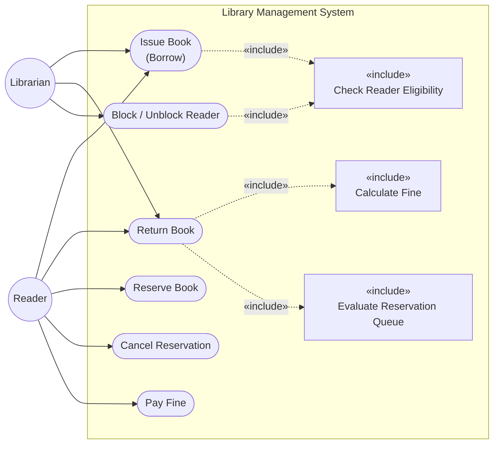

# Use Case Diagram

Actors and their interactions with the Library Management System.

- **Reader** — a registered library member who borrows, reserves, and pays fines.
- **Librarian** — library staff who processes loans/returns and manages reader standing.

## Use Case Descriptions

| Use Case | Primary Actor | Brief Description |
|---|---|---|
| **Issue Book** | Reader / Librarian | Reader requests a loan; system checks eligibility (not blocked, copy available, loan limit not exceeded) and creates a Loan. |
| **Return Book** | Reader / Librarian | Reader returns a copy; system records return date, calculates any overdue fine, restores the available-copy count, and notifies waiting reservers. |
| **Reserve Book** | Reader | Reader places a reservation on a fully-borrowed title; system adds it to the priority queue (PREMIUM before STANDARD, oldest first). |
| **Cancel Reservation** | Reader | Reader withdraws an active reservation before it expires or is fulfilled. |
| **Pay Fine** | Reader | Reader settles an outstanding fine; once all fines are paid and overdue count is within threshold, the reader may be unblocked. |
| **Block / Unblock Reader** | Librarian | Librarian (or automated evaluation) blocks a reader whose unpaid fines ≥ $10 or overdue-return count ≥ 3; unblocks when thresholds are cleared. |
