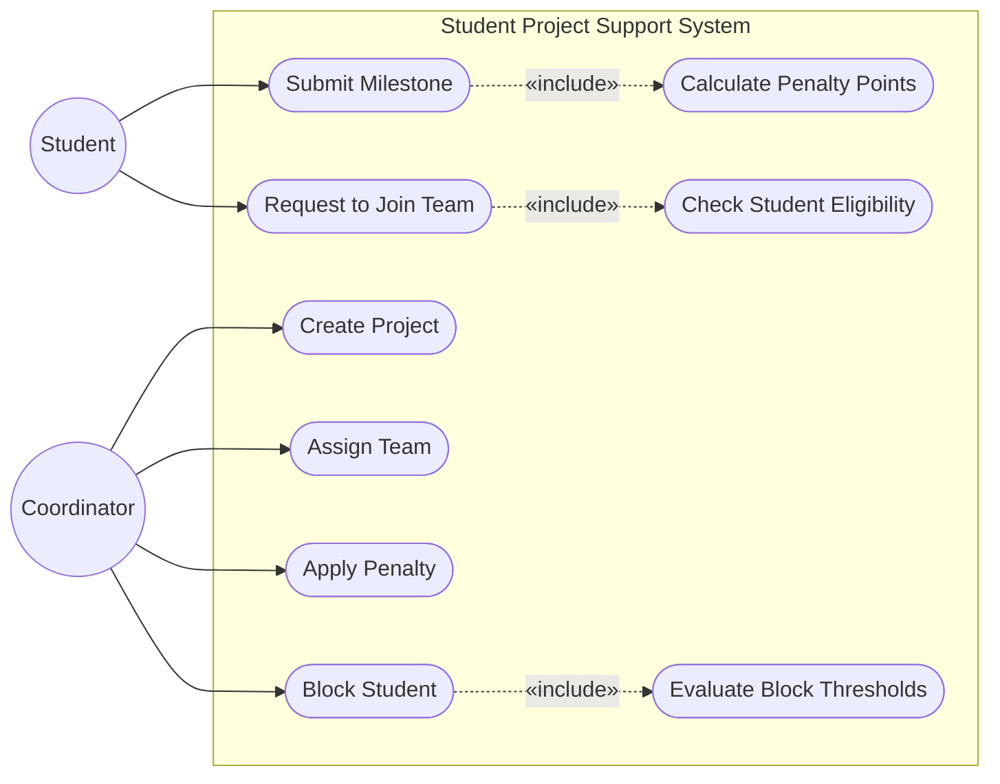

# Use Case Diagram

Actors and their interactions with the Student Project Support System.

- **Student** — a registered participant who submits milestones and requests to join project teams.
- **Coordinator** — academic staff who creates and manages projects, assigns teams, applies penalties, and manages student standing.

## Use Case Descriptions

| Use Case | Primary Actor | Brief Description |
|---|---|---|
| **Create Project** | Coordinator | Creates a DRAFT project with a title and description; a team may be pre-assigned. |
| **Assign Team** | Coordinator | Links an existing team to a non-archived project, enabling it to be moved to ACTIVE. |
| **Submit Milestone** | Student | Records a milestone submission; when past the due date the penalty strategy calculates and stores penalty points for every team member. |
| **Request to Join Team** | Student | Joins the team directly if space is available; otherwise creates a queue request prioritised by fewest active projects, then FIFO. |
| **Apply Penalty** | Coordinator | Marks an overdue milestone as MISSED and creates penalty records for all team members via the configured penalty strategy. |
| **Block Student** | Coordinator | Blocks a student whose unresolved penalty points or missed-deadline count exceed configured thresholds; blocked students cannot join teams. |
